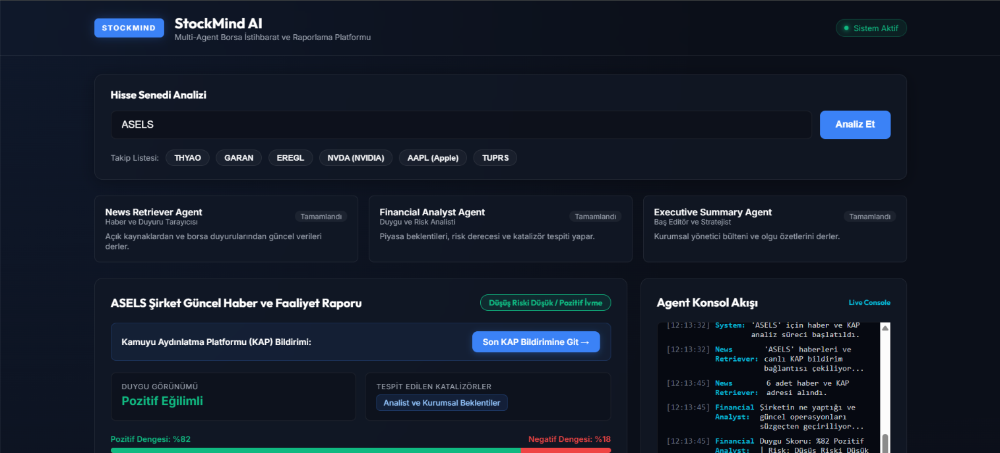
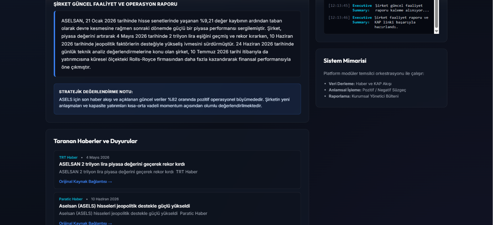

# StockMind AI - Finansal Haber ve Duygu Analizi Platformu

StockMind AI, belirtilen borsa hisse senetleri için güncel web kaynaklarındaki haberleri ve finansal duyuruları derleyen, metin içeriklerini Büyük Dil Modelleri (Google Gemini LLM) ve finansal risk algoritmaları ile süzgeçten geçiren kurumsal düzeyde bir çoklu temsilci (multi-agent) borsa istihbarat platformudur.

---

## Uygulama Ekran Görüntüleri



<br>



---

## Mimari Yapı

Platform, her biri kendi alanında uzmanlaşmış üç temel temsilci bileşeninden oluşur:

1. **Haber ve Duyuru Tarayıcısı (News Retriever Agent):**
   - Belirtilen hisse senedi simgeleri için canlı haber akışını ve finansal gelişmeleri derler.
2. **Finansal Analiz ve Duygu Temsilcisi (Financial Analyst Agent):**
   - Derlenen verileri anlamsal açıdan analiz ederek piyasa duygu skorunu (Boğa/Ayı dengesi), risk düzeyini ve temel katalizörleri hesaplar.
3. **Baş Editör ve LLM Stratejisti (Executive Summary Agent):**
   - Taranan haber metinlerini doğrudan Google Gemini LLM ile okuyup anlamlandırarak şirketin güncel operasyonel faaliyetlerini anlatan kurumsal haber raporu kaleme alır.

---

## Kurulum ve Çalıştırma

### Gereksinimler
- Python 3.8 veya üzeri sürüm

### Çevre Değişkenleri
`.env.example` dosyasını kopyalayarak `.env` dosyası oluşturun ve Google Gemini API anahtarınızı ekleyin:
```env
GEMINI_API_KEY=buraya_api_anahtarinizi_yazin
```

### Uygulamayı Başlatma
1. Proje ana dizininde sunucuyu başlatın:
   ```bash
   python server.py
   ```
2. Tarayıcı üzerinden erişim sağlayın:
   ```text
   http://localhost:8000
   ```

---

## Proje Dizini Yapısı

```text
samp-agent/
├── agent_engine.py   # Multi-Agent veri işleme, LLM ve analiz motoru
├── server.py         # HTTP API ve statik dosya sunucusu
├── index.html        # Glassmorphism kullanıcı arayüzü
├── style.css         # Tasarım ve stil kuralları
├── app.js            # İstemci tarafı durum yönetimi ve olay işleyicileri
├── .env.example      # Güvenli çevre değişkenleri şablonu
├── .gitignore        # Sürüm kontrolü istisnaları
└── README.md         # Proje dokümantasyonu
```
